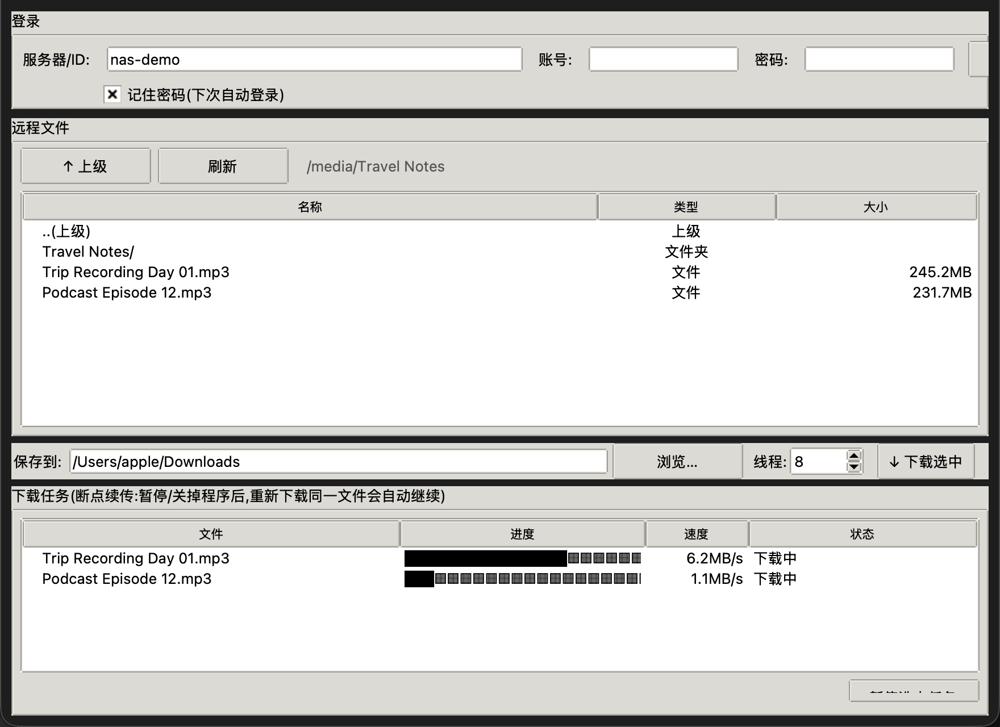

# SynDL — 群晖 DSM 多线程断点续传下载器

跨平台(macOS / Windows)图形界面下载客户端,登录群晖 DSM 后浏览文件并多线程下载,
支持断点续传、会话过期自动重登、QuickConnect ID 直连。**普通用户权限即可
(只需 File Station 访问权,无需管理员)。**



## 下载安装(推荐)

### macOS(推荐 Homebrew)

```bash
brew tap Feng-H/homebrew-tap
brew install --cask Feng-H/tap/syndl
```

升级:`brew upgrade --cask Feng-H/tap/syndl`。

### 其他方式

到 [Releases](../../releases) 页面下载对应平台的安装包:

| 平台 | 文件 | 说明 |
|---|---|---|
| Windows | `SynDL.exe` | 单文件,双击运行(无需安装 Python) |
| macOS(Apple Silicon) | `SynDL-macos-applesilicon.zip` | 解压得到 SynDL.app,拖入"应用程序" |

首次打开的安全提示:

- **macOS**:应用未做开发者签名,双击若被拦,请 **右键 → 打开**,或在
  系统设置 → 隐私与安全性 中点"仍要打开"。
- **Windows**:SmartScreen 可能提示"更多信息 → 仍要运行"。

### 发布新版本(维护者)

```bash
git tag v0.x.y && git push --tags     # CI 自动:测试 → 双平台打包 → GitHub Release
```

随后更新 [homebrew-tap](https://github.com/Feng-H/homebrew-tap) 中的
`Casks/syndl.rb`(version、sha256、url 三处)。

## 功能

- **登录**:支持 QuickConnect ID(如 `my-nas-id`,自动定位中继)、
  完整地址、内网/直连地址三种填法;支持两步验证(OTP)
- **自动登录**:勾选"记住密码"后,下次启动免输入直接进入(会话过期自动重登);
  密码优先存系统凭据库(macOS 钥匙串 / Windows 凭据管理器),
  不可用时降级为本机混淆文件(权限 600,非加密,界面会有提示)
- **主动退出**:登录后按钮变"退出",可选择是否同时忘记密码
- **多线程下载**:默认 8 线程(可调 1–32),按 16MB 分块并发、直写文件偏移
- **断点续传**:暂停、断网、关机都不要紧,重新下载同一文件自动从断点继续
- **自动重试与重登**:分块失败指数退避重试;DSM 会话失效自动重新登录续传
- **浏览**:双击进入目录,双击文件即下载,支持多选

## 从源码运行(开发/进阶)

需要 Python 3.9+(含 tkinter)和 `requests`:

```bash
# GUI
python3 syn_dl_gui.py

# 命令行:交互浏览下载 / 直接下载 / 列目录
python3 syn_dl.py
python3 syn_dl.py --get "/media/Travel Notes/Trip Recording Day 01.mp3" -w 16
python3 syn_dl.py --ls "/media"
```

仓库内附双平台双击启动脚本:`启动GUI.command`(macOS)、`启动GUI.bat`(Windows),
会自动检查/补装依赖。

## 打包发布(CI)

打包由 GitHub Actions 完成(见 [build.yml](.github/workflows/build.yml)),本地无需任何打包工具:

- **推送任意提交** → 自动运行全部测试(含 GUI 自动化,xvfb 虚拟显示)
- **打标签 `v*`**(如 `git tag v0.1.0 && git push --tags`)→
  测试通过后,Windows 运行器产出 `SynDL.exe`、macOS 运行器产出 `SynDL.app`,
  自动创建 GitHub Release 并附上安装包
- 也可在 Actions 页面手动触发(workflow_dispatch)验证打包

图标源文件:`icon.png`(`SynDL.icns` / `SynDL.ico` 由其生成)。

## 断点续传说明

- 进度保存在 `<文件名>.synstate`,下载完成并校验大小后自动删除;
- 中断后(断网、暂停、关程序)**重新下载同一文件**即可续传;
- 会话缓存 `~/.syn_dl_session.json`、凭据 `~/.syn_dl_credentials.json`(均为 600 权限)。
  "退出并忘记密码"会清除会话与保存的密码(含系统钥匙串条目)。

## 测试

```bash
python3 test_core.py   # 多线程 / 中断续传 / 分块断开重试 / 会话过期自动重登 / 状态文件竞态
python3 test_e2e.py    # 模拟 DSM:登录、目录浏览、带空格括号路径的下载
python3 test_qc.py     # QuickConnect ID 解析、会话缓存双形式匹配
python3 test_gui.py    # GUI 自动化:登录→浏览→下载→重复跳过(需要显示环境)
python3 test_cred.py   # 凭据存储、启动自动登录、退出忘记密码(需要显示环境)
```
